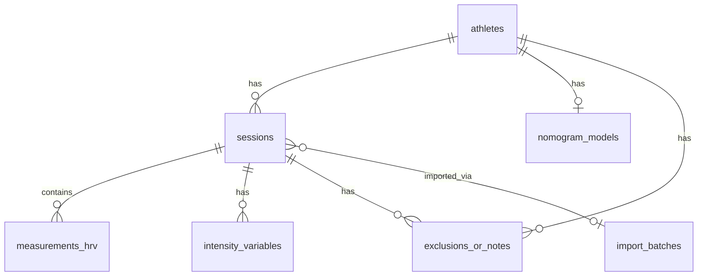

# DATA_MODEL.md — HRV Slope App

## Database Schema (SQLite via Drift)

---

### 1. `athletes`

| Column | Type | Constraints | Description |
|---|---|---|---|
| `id` | INTEGER | PK, autoincrement | Unique athlete ID |
| `name` | TEXT | NOT NULL | Full name |
| `sport` | TEXT | | Primary sport |
| `birth_date` | TEXT | | ISO 8601 date |
| `gender` | TEXT | | male / female / other |
| `position_or_event` | TEXT | | Position or event specialization (Phase 2) |
| `mas_kmh` | REAL | | Maximal Aerobic Speed (km/h) |
| `vvo2max_kmh` | REAL | | Speed at VO₂max (km/h) |
| `map_w` | REAL | | Maximal Aerobic Power (W) |
| `fc_max` | REAL | | Maximum heart rate (bpm) |
| `notes` | TEXT | | Free-text notes |
| `is_archived` | INTEGER | NOT NULL, DEFAULT 0 | 1 if athlete is soft-deleted (Phase 2) |
| `created_at` | TEXT | NOT NULL | ISO 8601 timestamp |
| `updated_at` | TEXT | NOT NULL | ISO 8601 timestamp |

---

### 2. `sessions`

| Column | Type | Constraints | Description |
|---|---|---|---|
| `id` | INTEGER | PK, autoincrement | Unique session ID |
| `athlete_id` | INTEGER | FK → athletes.id, NOT NULL | Athlete reference |
| `date` | TEXT | NOT NULL | Session date (ISO 8601) |
| `task_name` | TEXT | | Name of training task/drill |
| `sport` | TEXT | | Sport context for this session |
| `session_type` | TEXT | | training / incremental_test / match / etc. (Phase 2) |
| `protocol_name` | TEXT | | Protocol or drill name (Phase 2) |
| `context_environment` | TEXT | | Environment context (Phase 2) |
| `is_draft` | INTEGER | NOT NULL, DEFAULT 0 | 1 if session is incomplete (Phase 2) |
| `intensity_percent` | REAL | | X-axis value for nomogram |
| `intensity_source` | TEXT | | How intensity_percent was obtained |
| `recovery_time_min` | REAL | | Time from end of exercise to end of recovery window (min) |
| `recovery_window_start_min` | REAL | | Start of the 5-min recovery window (min post-exercise) |
| `recovery_window_end_min` | REAL | | End of the 5-min recovery window (Phase 2) |
| `rmssd_exercise` | REAL | | RMSSD last 5 min of exercise (ms) |
| `rmssd_exercise_is_default` | INTEGER | NOT NULL, DEFAULT 0 | 1 if 4 ms fallback was used |
| `rmssd_recovery` | REAL | NOT NULL | RMSSD during recovery window (ms) |
| `slope_raw` | REAL | | Computed raw RMSSD-Slope |
| `slope_interpreted` | REAL | | max(0.1, slope_raw) |
| `itl_index` | REAL | | 1 / slope_interpreted |
| `classification` | TEXT | | poor / good / very_good |
| `hrv_input_mode` | TEXT | | direct_rmssd / rr_intervals (Phase 2.1) |
| `rmssd_recovery_source` | TEXT | | manual / elite_hrv / kubios / computed_from_rr / etc. (Phase 2.1) |
| `rmssd_exercise_source` | TEXT | | measured / fallback_4_ms / computed_from_rr / etc. (Phase 2.1) |
| `rr_quality_flag` | TEXT | | valid / warning / invalid (Phase 2.1) |
| `rr_artifact_percent` | REAL | | Artifact percentage if RR was used (Phase 2.1) |
| `import_batch_id` | INTEGER | FK → import_batches.id | Batch reference if imported |
| `notes` | TEXT | | Session-level notes |
| `created_at` | TEXT | NOT NULL | ISO 8601 timestamp |

---

### 3. `measurements_hrv`

Raw HRV data storage (optional, for detailed analysis).

| Column | Type | Constraints | Description |
|---|---|---|---|
| `id` | INTEGER | PK, autoincrement | Unique measurement ID |
| `session_id` | INTEGER | FK → sessions.id, NOT NULL | Session reference |
| `phase` | TEXT | NOT NULL | exercise / recovery / rest |
| `window_start_min` | REAL | | Window start relative to exercise end |
| `window_end_min` | REAL | | Window end relative to exercise end |
| `rr_intervals_json` | TEXT | | JSON array of RR intervals in ms |
| `rmssd` | REAL | | Computed RMSSD for this window |
| `mean_hr` | REAL | | Mean heart rate in this window |
| `sdnn` | REAL | | Optional SDNN value |
| `created_at` | TEXT | NOT NULL | ISO 8601 timestamp |

---

### 4. `intensity_variables`

Flexible key-value storage for all session variables.

| Column | Type | Constraints | Description |
|---|---|---|---|
| `id` | INTEGER | PK, autoincrement | |
| `session_id` | INTEGER | FK → sessions.id, NOT NULL | Session reference |
| `category` | TEXT | NOT NULL | external / internal / hrv / derived / context |
| `name` | TEXT | NOT NULL | Variable name (e.g., "speed_kmh") |
| `unit` | TEXT | | Unit of measurement |
| `value` | REAL | NOT NULL | Numeric value |
| `source` | TEXT | | manual / csv / xlsx / device / calculated |
| `is_primary_for_nomogram` | INTEGER | NOT NULL, DEFAULT 0 | 1 if this variable is the primary nomogram input |
| `notes` | TEXT | | |
| `created_at` | TEXT | NOT NULL | ISO 8601 timestamp |

**Standard variable names:**

#### External Load
| Name | Unit | Category |
|---|---|---|
| `speed_kmh` | km/h | external |
| `percent_mas` | % | external |
| `percent_vvo2max` | % | external |
| `power_w` | W | external |
| `power_w_kg` | W/kg | external |
| `pace_min_km` | min/km | external |
| `distance_km` | km | external |
| `duration_min` | min | external |
| `player_load` | AU | external |
| `accelerations` | count | external |

#### Internal Load
| Name | Unit | Category |
|---|---|---|
| `rpe_borg` | 1-10 | internal |
| `srpe` | AU | internal |
| `trimp` | AU | internal |
| `hr_mean_bpm` | bpm | internal |
| `percent_hr_max` | % | internal |
| `lactate_mmol` | mmol/L | internal |
| `fatigue_subjective` | 1-10 | internal |

#### HRV
| Name | Unit | Category |
|---|---|---|
| `rmssd_exercise_ms` | ms | hrv |
| `rmssd_recovery_ms` | ms | hrv |
| `recovery_window_min` | min | hrv |

---

### 5. `nomogram_models`

| Column | Type | Constraints | Description |
|---|---|---|---|
| `id` | INTEGER | PK, autoincrement | |
| `athlete_id` | INTEGER | FK → athletes.id, NOT NULL, UNIQUE | One model per athlete |
| `param_a` | REAL | NOT NULL | Coefficient a (amplitude) |
| `param_b` | REAL | NOT NULL | Coefficient b (decay rate, < 0) |
| `param_c` | REAL | NOT NULL | Coefficient c (floor, ≥ 0.1) |
| `r_squared` | REAL | | Goodness of fit |
| `n_points` | INTEGER | NOT NULL | Number of data points used |
| `n_intensity_ranges` | INTEGER | NOT NULL | Number of distinct intensity ranges |
| `confidence_level` | TEXT | NOT NULL | insufficient / initial / acceptable / robust |
| `last_updated` | TEXT | NOT NULL | ISO 8601 timestamp |

---

### 6. `import_batches`

| Column | Type | Constraints | Description |
|---|---|---|---|
| `id` | INTEGER | PK, autoincrement | |
| `filename` | TEXT | | Original filename |
| `import_type` | TEXT | NOT NULL | csv / xlsx / manual / rr_intervals |
| `row_count` | INTEGER | | Number of rows imported |
| `error_count` | INTEGER | | Number of rows with errors |
| `notes` | TEXT | | |
| `created_at` | TEXT | NOT NULL | ISO 8601 timestamp |

---

### 7. `exclusions_or_notes`

| Column | Type | Constraints | Description |
|---|---|---|---|
| `id` | INTEGER | PK, autoincrement | |
| `session_id` | INTEGER | FK → sessions.id | Session reference (optional) |
| `athlete_id` | INTEGER | FK → athletes.id | Athlete reference (optional) |
| `type` | TEXT | NOT NULL | exclusion / note / flag |
| `reason` | TEXT | NOT NULL | Free text |
| `created_at` | TEXT | NOT NULL | ISO 8601 timestamp |

---

### 8. `app_settings`

| Column | Type | Constraints | Description |
|---|---|---|---|
| `key` | TEXT | PK | Setting key |
| `value` | TEXT | NOT NULL | Setting value (JSON encoded) |
| `updated_at` | TEXT | NOT NULL | ISO 8601 timestamp |

Default settings:
- `default_rmssd_exercise_ms`: 4.0
- `slope_min_for_interpretation`: 0.1
- `preferred_recovery_window_min`: 10
- `max_recovery_window_min`: 30
- `min_recovery_exclusion_min`: 5
- `nomogram_mode`: population / individual / hybrid
- `locale`: es / en

---

## Entity Relationships



---

## Intensity Percent Calculation

When `intensity_percent` is not directly provided, it can be derived:

```dart
// From speed and MAS
intensity_percent = (speed_kmh / athlete.mas_kmh) * 100;

// From speed and vVO2max
intensity_percent = (speed_kmh / athlete.vvo2max_kmh) * 100;

// From power and MAP
intensity_percent = (power_w / athlete.map_w) * 100;
```

Priority: direct import > speed/MAS > speed/vVO2max > power/MAP.

---

## Phase 1.5 Scientific Audit Data Notes

The calculation engine now distinguishes recovery window start, recovery window end, window duration, and the slope denominator:

| Concept | Storage / model field |
|---|---|
| Recovery window start | `sessions.recovery_window_start_min` and `RecoveryWindow.startMin` |
| Recovery window end / slope denominator | `sessions.recovery_time_min` and `RecoveryWindow.endMin` |
| Recovery window duration | Derived as `end - start`; must be 5 minutes for Phase 1.5 |
| Raw slope | `sessions.slope_raw` |
| Interpreted slope | `sessions.slope_interpreted`, equal to `max(0.1, slope_raw)` |
| Exercise RMSSD fallback flag | `sessions.rmssd_exercise_is_default` |

Population classification results now carry explicit model metadata and expected bands:

| Result field | Description |
|---|---|
| `model_source` | `paperOriginal2019`, `excelOperational`, `individual`, or `hybrid` |
| `preset_name` | Population preset name when population-based |
| `intensity_percent` | Session intensity used on the x-axis |
| `observed_slope` | Interpreted slope used for classification |
| `expected_lower`, `expected_mean`, `expected_upper` | Expected band values at the session intensity |
| `residual` | `observed_slope - expected_mean` |
| `residual_percent` | `residual / expected_mean * 100` |
| `classification` | Band-based internal-load classification |
| `warnings` | Range/extrapolation or model caveats |

RR quality control is currently a pure engine model, not persisted. `RrQualityReport` includes RR count, effective duration, mean/min/max valid RR, artifact estimate, quality flag, and quality notes. Phase 2 may decide where to persist these fields during import design.

---

## Phase 2.2 RR Preprocessing Metadata

Phase 2.2 persists RR-derived RMSSD audit summary fields on `sessions`:

| Column | Description |
|---|---|
| `rr_preprocessing_mode` | `none`, `rangeOnly`, `rangeAndEctopic`, or `localMedianThreshold` |
| `rr_correction_enabled` | Whether corrected NN-derived RMSSD was used |
| `rr_correction_method` | Linear correction method applied |
| `rr_raw_rmssd` | RMSSD computed from raw RR intervals |
| `rr_corrected_rmssd` | RMSSD computed from corrected NN intervals, nullable |
| `rr_rmssd_used` | RMSSD value used for slope |
| `rr_artifact_count` | Number of detected artifact/ectopic events |
| `rr_artifact_percent` | Percent of RR intervals marked |
| `rr_quality_decision` | valid / warning / invalid |
| `rr_quality_notes_json` | JSON-encoded audit notes |
| `rr_rmssd_delta_percent` | Percent change from raw to corrected RMSSD |

Full raw RR storage remains a future option. Phase 2.2 stores summary metadata sufficient to audit the RMSSD value used for slope.

---

## Phase 2.3 Session Edit/Delete Semantics

No schema changes were required for Phase 2.3. Database schema version remains 4.

Session detail/edit uses an aggregate containing:

| Component | Source |
|---|---|
| Athlete | `athletes` |
| Session metadata and derived values | `sessions` |
| External/internal/derived variables | `intensity_variables` |
| HRV recovery measurement | `measurements_hrv` |
| Session notes/flags | `exclusions_or_notes` |

Edit semantics:

- Metadata, external variables, internal variables, direct RMSSD values, and recovery window can be edited.
- Calculation-relevant edits recompute `intensity_percent`, raw slope, interpreted slope, ITL, and classification when intensity is available.
- The edit path uses `RecoveryWindow` + `computeSlopeForRecoveryWindow()` through the shared calculation preview.
- Direct RMSSD edit is the supported Phase 2.3 edit workflow. Existing RR preprocessing metadata remains visible in session detail; full RR reprocessing edit is deferred.

Delete semantics:

- `deleteSessionCascade(session_id)` hard-deletes application-owned child rows first:
  - `measurements_hrv`
  - `intensity_variables`
  - `exclusions_or_notes` linked to the session
  - `sessions`
- The linked athlete remains intact.
- `import_batches` remain intact.
