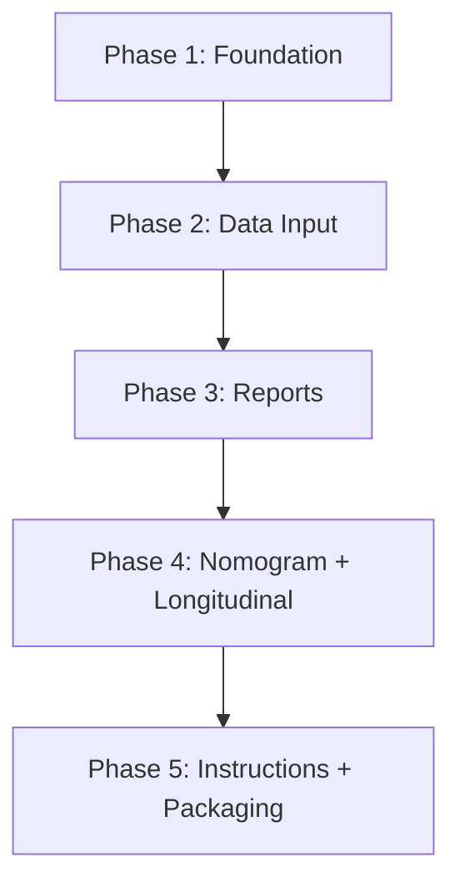

# IMPLEMENTATION_PLAN.md — HRV Slope App

## Overview

5-phase incremental build. Each phase has a gate: **tests must pass before advancing**.

---

## Phase 1: Foundation — Architecture + DB + Engine + Tests

### 1.1 Flutter Project Setup
- [ ] Create Flutter project with Windows and iOS targets.
- [ ] Configure `pubspec.yaml` with all dependencies.
- [ ] Set up clean architecture directory structure.

### 1.2 Database (Drift)
- [ ] Define all 8 tables in Drift format.
- [ ] Generate Drift code.
- [ ] Create DAOs for each entity.
- [ ] Implement repository interfaces in `domain/`.
- [ ] Implement repository classes in `data/`.

### 1.3 Calculation Engine (`shared/engine/`)
- [ ] `rmssd_calculator.dart` — `computeRmssd()`.
- [ ] `slope_calculator.dart` — `computeSlope()`, `clampSlopeForInterpretation()`, `computeItlIndex()`.
- [ ] `nomogram_engine.dart` — `classifySlopeByPopulationNomogram()`, `fitIndividualNomogram()`, `expectedSlopeAtIntensity()`, `computeResidual()`.
- [ ] `statistics.dart` — rolling averages, fatigue detection.
- [ ] `population_nomogram_constants.dart` — pre-fitted curves from reference data.

### 1.4 Core Constants & Errors
- [ ] `core/constants/hrv_constants.dart` — default RMSSD exercise (4 ms), min slope (0.1), recovery windows.
- [ ] `core/errors/` — custom exception types.

### 1.5 Tests (Phase 1 Gate)
- [ ] RMSSD with known RR intervals.
- [ ] Slope with measured RMSSD_exercise.
- [ ] Slope with 4 ms fallback.
- [ ] Error when recovery_time ≤ 5.
- [ ] Clamp minimum 0.1.
- [ ] ITL = 1/slope.
- [ ] Population nomogram classification at each intensity range.
- [ ] Individual nomogram fit with synthetic data.
- [ ] Residual computation.

**Gate:** All 9+ tests pass.

---

## Phase 2: Data Input — Import Wizard + Manual Entry

### 2.1 Athlete Management
- [ ] Athletes list screen (Home).
- [ ] Create / Edit / Delete athlete.
- [ ] Athlete profile with physiological thresholds (MAS, MAP, FCmax, etc.).

### 2.2 Import Wizard
- [ ] Step 1: Choose input method (manual / CSV / XLSX / RR intervals).
- [ ] Step 2: Map columns to variable schema (for CSV/XLSX).
- [ ] Step 3: Tag variables (category, unit, source, is_primary_for_nomogram).
- [ ] Step 4: Validate minimum requirements (≥1 external, ≥1 internal, ≥1 HRV).
- [ ] Step 5: Calculate intensity_percent if not provided.
- [ ] Step 6: Preview and confirm.

### 2.3 Manual Entry Form
- [ ] Athlete selector.
- [ ] Date picker.
- [ ] Task name.
- [ ] RMSSD exercise (optional, with fallback indicator).
- [ ] RMSSD recovery (required).
- [ ] Recovery time (required, validated > 5 min).
- [ ] Intensity percent (required, or derive from speed/MAS).
- [ ] Add multiple variables with category tags.

### 2.4 RR Intervals Input
- [ ] Paste raw RR intervals (comma/newline separated).
- [ ] Auto-compute RMSSD from intervals.
- [ ] Option to specify exercise vs recovery phase.

### 2.5 Validations
- [ ] At least 1 external, 1 internal, 1 HRV variable.
- [ ] Recovery time > 5 min.
- [ ] RMSSD values ≥ 0.
- [ ] Intensity percent > 0 and ≤ 200.

### 2.6 Tests (Phase 2 Gate)
- [ ] CSV import with correct tag mapping.
- [ ] Persistence: athlete → session → variables round-trip.
- [ ] Validation rejects incomplete data.
- [ ] Intensity auto-calculation from speed/MAS.

**Gate:** All import and persistence tests pass.

---

## Phase 3: Reports + Population Nomogram

### 3.1 Individual Report Screen
- [x] Header: athlete, sport, date, task.
- [x] Data section: intensity%, external variables, internal variables.
- [x] HRV section: RMSSD exercise, RMSSD recovery, recovery time.
- [x] Slope section: raw slope, interpreted slope, fallback indicator.
- [x] ITL section: ITL index, classification.
- [x] Nomogram point: position on population nomogram chart.
- [x] Auto-interpretation: text explanation of results.

### 3.2 Group Report Screen
- [x] Select task/date to compare.
- [x] Table/cards: subject, RMSSD exercise, RMSSD recovery, slope, classification.
- [x] Ranking by slope (ascending = higher load).
- [x] Alerts/labels for high internal-load responses.
- [x] Summary statistics.

### 3.3 Population Nomogram Screen
- [x] Chart with lower/mean/upper population bands.
- [x] Plot athlete data points colored by classification.
- [x] X-axis: intensity %. Y-axis: RMSSD-Slope.
- [x] Session point detail list below chart.
- [x] Legend with population bands and session points.

### 3.4 Tests (Phase 3 Gate)
- [x] Individual report renders with all sections.
- [x] Group report ranks correctly.
- [x] Nomogram chart places points accurately.
- [x] Classification matches reference table.

**Gate:** All report and nomogram tests pass.

---

## Phase 4: Individual Nomogram + Longitudinal Panel

### 4.1 Individual Nomogram
- [x] Collect all athlete sessions with valid (intensity, slope) pairs.
- [x] Determine confidence level.
- [x] Fit exponential model if sufficient data.
- [x] Display individual curve overlaid on population nomogram.
- [x] Hybrid mode when confidence is initial/acceptable.
- [x] Show residuals: observed vs expected.

### 4.2 Longitudinal Panel
- [ ] Time-series chart: RMSSD-Slope over sessions.
- [ ] Overlay: intensity percent.
- [ ] Overlay: RPE / sRPE / TRIMP (selectable).
- [ ] External load overlay (selectable variable).
- [ ] Expected vs observed slope (residual band).
- [ ] Rolling averages: 7, 14, 28 days (toggle).
- [ ] Fatigue flags: visual markers for concerning patterns.
- [ ] Date range selector.

### 4.3 Export
- [x] Export individual report data to CSV.
- [x] Export group report rows and summary to CSV.
- [x] Export longitudinal athlete data and fatigue flags to CSV.
- [x] Export individual nomogram points, exclusions, summary, and curves to CSV.
- [x] Export population nomogram curve points to CSV.
- [ ] Export to XLSX with formatted headers (deferred; no stable writer dependency currently included).

### 4.4 Tests (Phase 4 Gate)
- [x] Nomogram fit convergence with synthetic data.
- [x] Confidence levels assigned correctly.
- [x] Hybrid blending weights correct.
- [x] Rolling averages match manual calculations.
- [x] Fatigue flags triggered at correct thresholds.

**Gate:** All nomogram and longitudinal tests pass.

---

## Phase 5: Instructions + Polish + Packaging

### 5.1 Instructions Book
- [x] What is RMSSD-Slope.
- [x] Measurement protocol.
- [x] How to record last 5 minutes of exercise.
- [x] How to record recovery (seated, relaxed).
- [x] Why skip first 5 minutes of recovery.
- [x] How to load data.
- [x] How to interpret population nomogram.
- [x] How to build individual nomogram.
- [x] Examples of external and internal load variables.
- [x] Limitations: not a medical diagnostic tool.
- [ ] References: Naranjo Orellana et al. 2019.

### 5.2 App Polish
- [ ] Dark theme with premium feel.
- [ ] Smooth animations and transitions.
- [ ] Responsive layout (Windows desktop + iOS).
- [ ] Error handling with user-friendly messages.
- [ ] Empty states with guidance.

### 5.3 Packaging
- [ ] Windows: MSIX or standard installer.
- [ ] iOS: Xcode archive for TestFlight / App Store.
- [ ] App icon and splash screen.

### 5.4 Final Validation
- [ ] Full regression test suite passes.
- [ ] Manual walkthrough of all 7 screens.
- [ ] Data persistence verified across app restart.
- [ ] Export files open correctly in Excel.

**Gate:** Complete test suite passes + manual verification.

---

## Dependency Graph

---

## Current Status

Historical phase notes below are chronological. Deferred items listed in older
phase sections may have been completed in later phases.

| Phase | Status | Tests |
|---|---|---|
| 1 | ✅ Complete | 67/67 |
| 1.5 | ✅ Audit Complete | (included in Phase 1) |
| 2 | ✅ MVP Complete | 36 new (104 total) |
| 2.1 | ✅ Complete | 34 new (138 total) |
| 2.2 | ✅ Complete | 167 total |
| 2.2b | ✅ Complete | 175 total |
| 2.3 | ✅ Complete | 15 new (190 total) |
| 3.0 | ✅ Complete | 30 new (220 total) |
| 3.1 | ✅ Complete | 23 new (243 total) |
| 4.0A | ✅ Complete | 26 new (269 total) |
| 4.0B | ✅ Complete | 33 new (302 total) |
| 4.0C Step 2 | ✅ Documentation Cleanup | 302 total |
| 4.1 | ✅ Export MVP | 23 new (325 total) |
| 5.0 | ✅ Instructions Book MVP | 12 new (337 total) |
| 5.1 | ✅ Release Readiness + Windows Build | 3 new (340 total) |

---

## Phase 1.5: Scientific Audit Gate

Status: completed before Phase 2 UI/import work.

Scope completed:

- [x] Audited slope timing and added explicit recovery window validation.
- [x] Preserved raw and interpreted slope values in slope results.
- [x] Verified fallback exercise RMSSD flag behavior.
- [x] Replaced unstable population interpretation with explicit presets and piecewise monotonic log-linear interpolation.
- [x] Added `paper_original_2019` and `excel_operational` population presets.
- [x] Made `excel_operational` the explicit default population preset.
- [x] Revised classification to compare observed interpreted slope against expected lower/mean/upper bands.
- [x] Added model source, expected bands, residuals, residual percent, and warnings to classification results.
- [x] Revised individual nomogram confidence rules and hybrid weights.
- [x] Added pure RR quality-control models and functions.
- [x] Added/updated scientific audit tests.
- [x] Ran format, analyzer, and all tests.

Gate result:

- Tests: 67/67 passing (engine_test.dart).
- Analyzer: no issues found.

---

## Phase 2: Data Input — MVP Vertical Slice

Status: ✅ Complete (2026-05-25)

Scope completed:

- [x] App shell with bottom navigation (Athletes, New Session, Import, Settings).
- [x] Athlete list with cards, archive, edit, delete, detail screen.
- [x] 6-step session wizard (athlete → session → external → internal → HRV → preview+save).
- [x] Intensity resolver with 6-path priority chain.
- [x] Calculation preview using RecoveryWindow + computeSlopeForRecoveryWindow().
- [x] CSV import with auto column mapping, validation, batch import.
- [x] RR interval parser (comma/newline/semicolon/tab).
- [x] Settings screen with population nomogram preset selection.
- [x] Database schema v1→v2 migration (non-destructive).
- [x] Legacy slope guard check: no computeSlope() in UI/import.
- [x] 36 new tests passing.

Gate result:

- Tests: 104/104 passing (67 engine + 36 phase2 + 1 widget).
- Analyzer: 18 info-level issues (0 errors, 0 warnings).
- build_runner: succeeded.

Deferred to Phase 2.1:

- RR paste UI (parser + tests exist).
- XLSX import.
- Session edit/delete from detail screen.

---

## Phase 2.1: Dual HRV Input System

Status: ✅ Complete (2026-05-26)

Scope completed:

- [x] Dual HRV input mode selector in Session Wizard (Direct RMSSD / RR Intervals).
- [x] Direct RMSSD mode with source tracking (Elite HRV, Kubios, HRV Logger, Polar, Garmin, Manual, Other).
- [x] RR Intervals mode with paste text area, parse + quality assessment, RMSSD computation.
- [x] Generic RMSSD CSV import mapper with auto column detection.
- [x] Recovery window validation: window 0–5 rejected, duration must be 5 min, max end 30 min.
- [x] HRV metadata columns added: hrv_input_mode, rmssd_recovery_source, rmssd_exercise_source, rr_quality_flag, rr_artifact_percent.
- [x] Database schema v2→v3 migration (non-destructive).
- [x] RR sample fixture tests (3 simulated samples with quality checks).
- [x] 34 new tests passing.

Gate result:

- Tests: 138/138 passing (67 engine + 36 phase2 + 34 phase2.1 + 1 widget).
- Analyzer: 16 info-level issues (0 errors, 0 warnings).
- build_runner: succeeded.

Deferred to Phase 2.2/3:

- XLSX import.
- Session edit/delete from detail screen.
- Longitudinal charts.

---

## Phase 2.2: RR/NN Preprocessing Engine

Status: ✅ Complete (2026-05-26)

Scope completed:

- [x] Added pure Dart RR preprocessing models and enums.
- [x] Added raw RMSSD computation from RR intervals.
- [x] Added range outlier detection.
- [x] Added Malik, Kamath, Karlsson, and Acar ectopic detection.
- [x] Added Kubios-inspired local median threshold detection.
- [x] Added linear interpolation for marked intervals.
- [x] Added raw vs corrected RMSSD comparison and delta metrics.
- [x] Kept correction off by default.
- [x] Updated RR input widget with preprocessing controls, audit display, and artifact table.
- [x] Updated calculation preview with RR preprocessing metadata.
- [x] Added session persistence fields for RR preprocessing summary metadata.
- [x] Database schema v3→v4 migration (non-destructive).
- [x] Added Phase 2.2 tests.
- [x] Added `HRV_RR_PREPROCESSING_SPEC.md`.

Gate result:

- Tests: 167/167 passing.
- Analyzer: no issues found.
- build_runner: succeeded.

Deferred:

- Full Lipponen-Tarvainen automatic correction.
- Cubic interpolation.
- Raw ECG/PPG filtering and peak detection.
- Full raw RR storage policy.

---

## Phase 2.2b: Mandatory Real RR Fixture Validation

Status: ✅ Complete (2026-05-26)

Scope completed:

- [x] Made `test/fixtures/rr_samples` validation mandatory.
- [x] Added required-file tests for all three real RR fixture files.
- [x] Added file-specific count, duration, RMSSD, min/max RR, artifact count, and quality assertions.
- [x] Verified parser behavior for Windows/Unix line endings and trailing blank lines.
- [x] Removed conditional fixture skip behavior.

Gate result:

- Tests: 175/175 passing.
- Analyzer: no issues found.

---

## Phase 2.3: Session Edit/Delete, UX Stabilization, Build Readiness

Status: ✅ Complete (2026-05-26)

Scope completed:

- [x] Added session detail screen accessible from athlete detail.
- [x] Added edit session flow for metadata, external/internal variables, direct RMSSD values, and recovery window.
- [x] Recomputed intensity, slope, ITL, and classification after calculation-relevant edits.
- [x] Added delete confirmation and transactional cascade delete for session-owned rows.
- [x] Added session detail aggregate and DAO/service helpers.
- [x] Labeled draft sessions and kept incomplete sessions from showing slope/classification.
- [x] Improved athlete detail session list and empty state guidance.
- [x] Added Phase 2.3 regression tests.

Gate result:

- Tests: 190/190 passing.
- Analyzer: no issues found.
- Schema: unchanged, still version 4.
- build_runner: not required.

Deferred to Phase 3:

- Longitudinal charts.
- Individual nomogram UI.
- Final report/PDF/export screens.

---

## Phase 3.0: Individual Report + Population Nomogram MVP

Status: ✅ Complete (2026-05-26)

Scope completed:

- [x] Individual report data model and pure builder function.
- [x] 7-section individual report screen (header, warnings, external/internal load, HRV, slope result, nomogram).
- [x] Population nomogram chart widget using fl_chart.
- [x] Nomogram chart renders lower/mean/upper bands with session point overlay.
- [x] Classification interpretation text (neutral training-load language).
- [x] Navigation: session detail → Open Report button.
- [x] Preset from settings (excel_operational / paper_original_2019).
- [x] Extrapolation warnings for out-of-range intensity.
- [x] Draft session handling (warnings, no false classification).
- [x] 30 new tests passing.

Gate result:

- Tests: 220/220 passing.
- Analyzer: no issues found.
- Schema: unchanged, still version 4.
- build_runner: not required.

Deferred to Phase 3.1:

- Group/team comparison views.
- Standalone population nomogram screen.
- Multi-session nomogram points.

Deferred to later phases:

- Longitudinal slope trend charts.
- Individual nomogram fitting UI.
- PDF export.
- "View Report" link from wizard save success.

---

## Phase 3.1: Group Report + Standalone Population Nomogram

Status: ✅ Complete (2026-05-26)

Scope completed:

- [x] Added pure `GroupReportData` builder and summary models.
- [x] Added group report screen with date, task, and session type filters.
- [x] Ranked complete sessions by interpreted slope ascending.
- [x] Kept incomplete sessions after ranked rows and surfaced warnings.
- [x] Added group summary statistics and classification counts.
- [x] Added Reports tab to app shell.
- [x] Added standalone population nomogram screen.
- [x] Extended `NomogramChart` for multiple observed session points while preserving the single-point API.
- [x] Added preset switching between `excel_operational` and `paper_original_2019`.
- [x] Added athlete filter on the standalone nomogram screen.
- [x] Added Phase 3.1 tests and regression guards.

Gate result:

- Tests: 243/243 passing.
- Analyzer: no issues found.
- Schema: unchanged, still version 4.
- build_runner: not required.

Deferred to Phase 4/later:

- Longitudinal dashboard.
- Individual nomogram fitting UI.
- PDF/export report.

---

## Phase 4.0A: Athlete Longitudinal Dashboard MVP

Status: ✅ Complete (2026-05-26)

Scope completed:

- [x] Added pure longitudinal data builder and models.
- [x] Added longitudinal summary with latest slope, latest ITL, latest classification, mean/min/max slope, mean ITL, and trend direction.
- [x] Added rolling slope averages for 7, 14, and 28 sessions.
- [x] Added rolling ITL averages for 7, 14, and 28 sessions.
- [x] Added fatigue/training-context flags with visible thresholds.
- [x] Added reusable longitudinal chart widget.
- [x] Added athlete longitudinal dashboard screen.
- [x] Added Athlete Detail → Longitudinal navigation.
- [x] Added slope trend chart.
- [x] Added ITL trend chart.
- [x] Added load overlay MVP for intensity, RPE, sRPE, and TRIMP.
- [x] Added residual trend list.
- [x] Added fatigue flag list with neutral training-load language.
- [x] Added chronological session list with Open Report action.
- [x] Added Phase 4.0A tests and regression guards.

Gate result:

- Tests: 269/269 passing.
- Analyzer: no issues found.
- Schema: unchanged, still version 4.
- build_runner: not required.

Deferred:

- Individual nomogram fitting UI.
- Hybrid population/individual overlay.
- PDF/export report.
- XLSX export.

---

## Phase 4.0B: Individual Nomogram Fitting UI + Hybrid Overlay

Status: ✅ Complete (2026-05-26)

Scope completed:

- [x] Added pure individual nomogram builder and models.
- [x] Included only valid sessions with `intensity_percent` and interpreted slope.
- [x] Excluded draft sessions, missing intensity, missing slope, and invalid values with explicit reasons.
- [x] Applied audited confidence rules and hybrid weights.
- [x] Fitted individual model when confidence is initial, acceptable, or robust.
- [x] Computed population, individual, and hybrid residuals where available.
- [x] Extended `NomogramChart` with optional individual and hybrid curve overlays.
- [x] Added individual nomogram screen with header, confidence card, data needs, overlay chart, valid points, and excluded sessions.
- [x] Added Athlete Detail → Individual Nomogram navigation.
- [x] Added Longitudinal Dashboard → Nomogram navigation.
- [x] Added Phase 4.0B tests and regression guards.

Gate result:

- Tests: 302/302 passing.
- Analyzer: no issues found.
- Schema: unchanged, still version 4.
- build_runner: not required.

Deferred:

- PDF/export report.
- XLSX export.
- Raw ECG/PPG processing.
- Backend/cloud/login/telemetry.

---

## Phase 4.1: Export MVP — CSV First

Status: ✅ Complete (2026-05-27)

Scope completed:

- [x] Added export models and CSV export service.
- [x] Added robust CSV field escaping for commas, quotes, newlines, semicolons, blank values, numeric formatting, and UTF-8 text.
- [x] Added default `exports/` file writer for local CSV output.
- [x] Added individual report CSV export.
- [x] Added group report rows and summary CSV exports.
- [x] Added longitudinal athlete data and fatigue flag CSV exports.
- [x] Added individual nomogram valid points, excluded sessions, model summary, and curve CSV exports.
- [x] Added population nomogram curve CSV export for `excel_operational` and `paper_original_2019`.
- [x] Added Export CSV buttons on individual report, group report, population nomogram, longitudinal dashboard, and individual nomogram screens.
- [x] Added Phase 4.1 export tests and regression guards.

Gate result:

- Tests: 325/325 passing.
- Analyzer: no issues found.
- Schema: unchanged, still version 4.
- build_runner: not required.

Deferred:

- XLSX export; current dependencies support spreadsheet reading but not stable XLSX writing.
- PDF export.
- Packaging/installer work.

---

## Phase 5.0: In-App Instructions Book MVP

Status: ✅ Complete (2026-05-27)

Scope completed:

- [x] Added static offline instructions content model.
- [x] Added in-app Instructions Book screen.
- [x] Added visible app shell navigation entry.
- [x] Added chapter selector and search/filter.
- [x] Added scientific disclaimer and recommended workflow callout.
- [x] Added overview, measurement protocol, data entry, direct RMSSD, RR interval, interpretation, reports/exports, and limitations/good-practice chapters.
- [x] Documented direct RMSSD as recommended/default workflow.
- [x] Documented RR interval workflow as advanced with correction off by default and raw RMSSD preserved.
- [x] Documented recovery window timing, including 5-10 means `t = 10`.
- [x] Documented CSV export availability and XLSX/PDF deferred status.
- [x] Added Phase 5.0 tests and navigation/content regression guards.

Gate result:

- Tests: 337/337 passing.
- Analyzer: no issues found.
- Schema: unchanged, still version 4.
- build_runner: not required.

Deferred:

- Full references chapter/detail page.
- PDF export.
- XLSX export.
- Packaging/installer work.

---

## Phase 5.1: Release Readiness + Windows Build

Status: ✅ Complete (2026-05-27)

Scope completed:

- [x] Added release readiness checklist.
- [x] Reviewed README for run, test, analyze, Windows build, export folder,
      privacy, and limitation guidance.
- [x] Verified app shell navigation exposes Athletes, New Session, Import,
      Reports, Instructions, and Settings.
- [x] Added export folder and filename-safety regression coverage.
- [x] Audited dependencies and code references for backend, cloud, auth,
      telemetry, analytics, crash reporting, and network clients.
- [x] Attempted Windows release build.

Gate result:

- Tests: 340/340 passing.
- Analyzer: no issues found.
- Schema: unchanged, still version 4.
- build_runner: not required.
